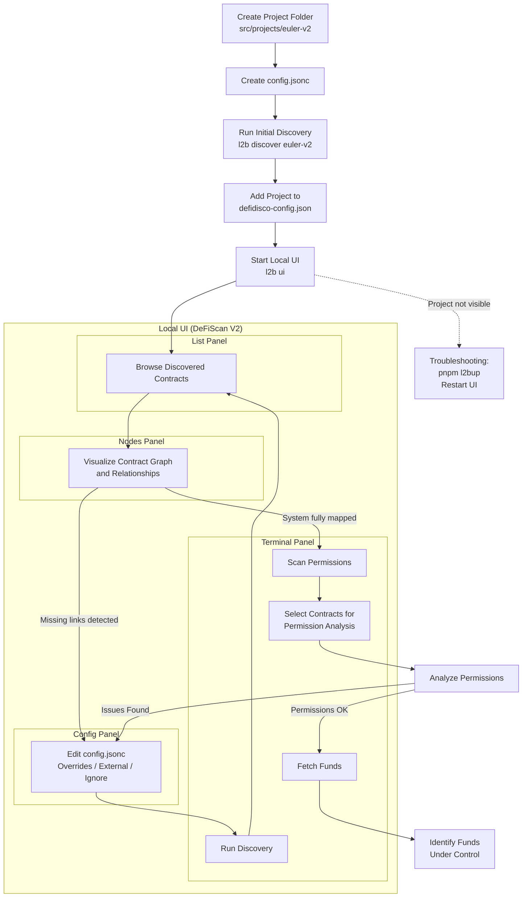

# Getting Started

This guide walks you through setting up DeFiScan V2 and analyzing your first DeFi protocol with our tool.

## Installation

Clone the repository and install dependencies:

```bash
git clone https://github.com/deficollective/defi-disco.git
cd defi-disco
pnpm i
cd packages/l2b
pnpm l2bup
```

## Setup Environment Variables

Create a `.env` file inside the `packages/config` folder:

```bash
cd ../config
```

Add the following environment variables to `.env`:

```env
ETHERSCAN_API_KEY=your_etherscan_api_key
ETHEREUM_RPC_URL_FOR_DISCOVERY=https://your-rpc-url

# at least one of both for AI permission detection
OPENAI_API_KEY=...
ANTHROPIC_API_KEY=...
```

## Analyse your first protocol

The tool gives the researcher two options to start the research process, either through working directly with the files and the terminal or by starting the UI. For deeper analysis the UI is highly recommended. For the initial process however, the terminal is recommended, if the protocol is already well understood, as this it allows for more fine grained control from the start. Otherwise just start with the UI.

With video assistance: https://www.loom.com/share/eb082048da0545fb89db7299e68386e9

## Start with UI

```bash
pnpm l2b ui
```

The app running on http://localhost:2021/ui has a mask allows to specify the first contracts to analyse. The tool will discover more contracts that belong to this project.

You click on the plus symbol this opens the mask for creating a new project. You type in the name of the protocol and a first address or addresses you want to scan. Make sure they follow the form `eth:0x...` if on mainnet, and check this list here if the contracts live on another chain: https://github.com/deficollective/defi-disco/blob/main/packages/shared-pure/src/types/ChainSpecificAddress.ts#L14

## Start with CLI

With video assistance: https://www.loom.com/share/864443fb11f8451a9392dac849c97199

1. Create a new project folder inside `./packages/config/src/projects`:

```bash
mkdir -p src/projects/euler-v2
```

2. Create a `config.jsonc` file in your project folder:

```jsonc
{
  "$schema": "../../../../discovery/schemas/config.v2.schema.json",
  "name": "euler-v2",
  "import": ["../globalConfig.jsonc"],
  "initialAddresses": ["eth:0x35400831044167E9E2DE613d26515eeE37e30a1b"],
  "defidisco": {
    "scanPermissions": false,
    "permissionLimits": {
      "maxSourceFiles": 35
    }
  },
  "overrides": {
    "eth:0xae7ab96520DE3A18E5e111B5EaAb095312D7fE84": {
      "ignoreDiscovery": true
    }
  }
}
```

Execute the discovery process from the `packages/config` directory:

```bash
l2b discover euler-v2
```

### Continue Analysis

After first run, we suggest you to start the local UI to facilitate discovery of the entire DeFi project.

To see the project in the UI, head to `packages/config/src/defidisco-config.json` and add the project name (make sure same as folder name).

```json
{
  "version": "1.0",
  "description": "DeFiScan V2 configuration for DeFi project filtering",
  "defiProjects": [
    "compound-v3",
    "uniswap-v2",
    "morpho",
    "lido",
    "liquity-v2",
    "euler-v2" <--- here
  ],
  "lastUpdated": "2026-01-09"
}

```

Then run:

```bash
pnpm l2b ui
```

**Note:** Discovery must always be run from the `./packages/config` directory.


**Troubleshooting ⚠️** 

> If the project does not show up in the local app, stop the app, run `pnpm l2bup` inside the `packages/config` folder, and restart the service.

## Discovery

Using 4 panels

- list
- nodes
- terminal
- config

You go through the discovered contracts (with list and nodes), see if there are missing links to other system relevant contracts, you mark contract as external if you find oracles/bridges/yield sources etc.

Then you adapt the `config.jsonc`, once you're satisfied to run another discovery episode, you select the terminal view and you press `Run discovery`.

## Working with Factory Patterns (Templates)

With Video assistance: https://www.loom.com/share/ed428db408bd4e61bd95cbd3e44b94a0

When analyzing DeFi protocols with factories that deploy multiple contracts with identical bytecode (e.g., Uniswap pools, Euler vaults, etc.), you can use **templates** to configure the discovery process. Templates set standards for what fields are queried and how data is extracted from factory-deployed contracts, ensuring consistent analysis across all instances.

### How Templates Work

- Discovery matches contracts by **bytecode hash**
- You only need **one example contract** to establish the hash. After that no need to manually configure every deployment
- All contracts with matching bytecode automatically receive the template configuration

### Template Files

Templates live in `packages/config/src/projects/_templates/` and consist of:

| File | Purpose |
|------|---------|
| `template.jsonc` | Defines how to analyze the contract (fields, handlers, ignored methods) |
| `shapes.json` | Stores the bytecode hash and one reference deployment |

### Adding a Template

1. **Create the template folder and file:**
   ```bash
   mkdir -p packages/config/src/projects/_templates/euler-v2/EVault
   ```

2. **Create `template.jsonc`** with your configuration:
   ```jsonc
   {
     "$schema": "../../../../../../discovery/schemas/contract.v2.schema.json",
     "displayName": "EVault",
     "description": "Euler V2 EVault",
     "ignoreMethods": ["accumulatedFees", "accumulatedFeesAsset", "convertToAssets", "convertToShares", "interestAccumulator", "permit2Address", "previewDeposit", "previewWithdraw", "previewMint", "previewRedeem"]
   }
   ```

   > You MUST not change the `$schema` field.

3. **Register the bytecode hash** using any deployed instance:
   ```bash
   l2b add-shape ethereum <blockNumber> EVault euler-v2/EVault 0x<vault-address>
   ```

   > This creates the `shapes.jsonc` file and stores the bytecode hash.

   > If the contracts deployed are factories, take the implementation contract address for adding the shape. Otherwise shapes/templates are not matched (see ⚠️ Warning: Proxy Factory Deployments)

4. **Re-run discovery** - all vaults with matching bytecode will now use the template:
   ```bash
   l2b discover euler-v2
   ```

### Effect

After adding a template, discovery automatically applies the configuration to **all** contracts with matching bytecode. This is particularly useful for protocols with hundreds of pool/vault instances.

<details>
<summary><strong>⚠️ Warning: Proxy Factory Deployments</strong></summary>

When dealing with **proxy contracts** (Beacon proxies, UUPS, etc.), the `l2b add-shape` command will register the **proxy bytecode hash** if the proxy address is given as argument, **make sure to use the implementation address**.

**Why this matters:** _Discovery_ uses the **implementation hash** (not the proxy hash) for **template matching**. If you register the wrong hash, your template won't be applied.

**How to identify the issue:**

After running discovery, check the contract's `sourceHashes` in `discovered.json`:

```json
"sourceHashes": [
  "0x03b737c5...",
  "0x1ae4cf8a..."
]
```

For proxy contracts, the array contains multiple hashes. _Discovery_ skips the first (proxy) and matches against subsequent hashes (implementation).

**How to fix:**

Manually update `shapes.json` to use the **implementation hash** (the second entry in `sourceHashes`):

```json
{
  "EVault": {
    "hash": "0x1ae4cf8a...",  // Use implementation hash, not proxy hash
    "address": "eth:0x...",
    "chain": "ethereum",
    "blockNumber": 12345678
  }
}
```

</details>

## Permission Analysis

With Video assistance: https://www.loom.com/share/2ab2259eb35449a78a8060e2fd6fd8a8

When you think you have the whole system mapped, choose the `Scan Permissions` button inside the terminal. This will allow you to select the contracts for which you want permissions to be analysed.

## Call Graph Analysis

To use the call graph generation feature, you need to install [Slither](https://github.com/crytic/slither) and the Solidity compilers.

```bash
# Create a virtual environment
python3 -m venv ~/.slither-venv
source ~/.slither-venv/bin/activate

# Install Slither and solc-select
pip install slither-analyzer solc-select

# Install Solidity compilers:
solc-select install all
```

> **Note:** DeFi protocols use various Solidity versions (0.4.x through 0.8.x). Installing all versions upfront avoids interruptions during analysis, but you can also install them on-demand when Slither reports a missing compiler.

> **Note:** If you already have Slither installed elsewhere, set the `SLITHER_PATH` environment variable to point to your binary.

## Track Funds

Once you have a clear overview of the permissions, it's important to know which funds are controlled by these permissions.

Start by marking which contract you want funds data on using the `Nodes` panel of the UI. You can decide to fetch all balances or DeFi positions for a given contract, and/or mark it as a token contract to know its the token price and market capitalization. Use the button `Fetch Funds` inside the terminal to fetch the data. Make sure the DeFiScan API service is running.

## DeFiScan Panel

After running discovery, scanning permissions, and fetching funds, open the DeFiScan panel to see the scoring dashboard. This panel combines all collected data into a structured breakdown.

## Flow Chart

